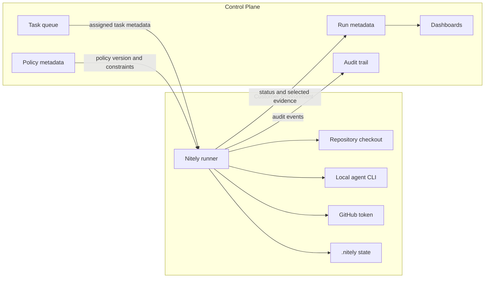
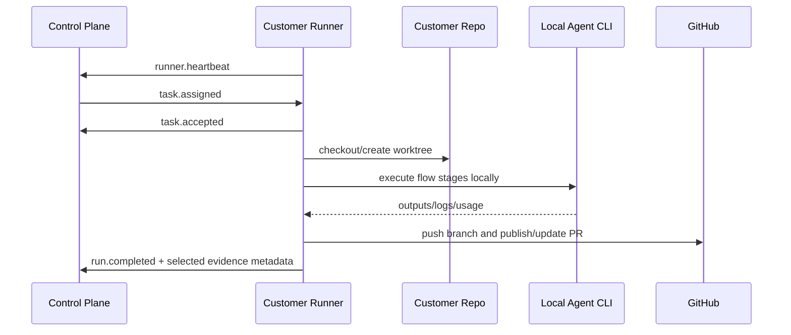
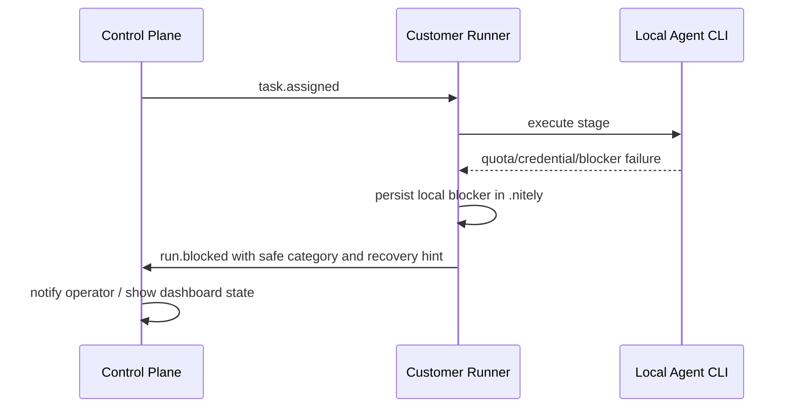
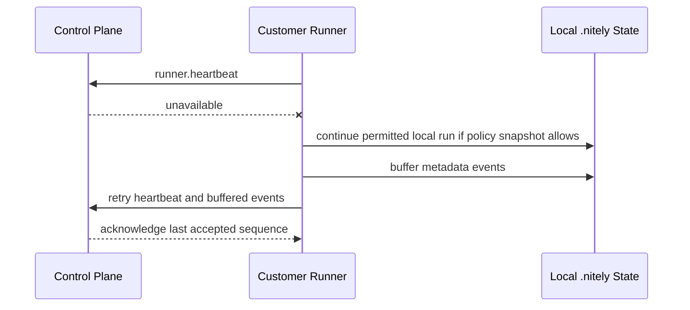

# Customer-Hosted Runner Boundary

Status: architecture design for #97 with a minimal local protocol stub for
#275. The production hosted control plane is still future work; the executable
stub exists so paid-pilot protocol behavior can be tested without SaaS.

Nitely's runner model should preserve the security rule from
[security-and-trust.md](security-and-trust.md):

> Code, secrets, and agent execution remain in the customer's environment unless
> explicitly configured otherwise.

## Architecture Summary

The runner is a process operated in the customer's environment. It executes
Nitely flows against customer repositories, local agent CLIs, local credentials,
and local `.nitely` state.

The control plane coordinates work. It owns queues, policy metadata, visibility,
permissions, and audit records, but it does not need raw source code, full
worktrees, raw prompts, agent credentials, GitHub tokens, or raw command logs by
default.

## Trust Boundary

### Security-Sensitive Data Classes

Inside the customer environment by default:

- repository source code;
- checked-out worktrees;
- input snapshots;
- raw prompts and full agent context;
- agent credentials;
- GitHub tokens;
- provider credentials;
- raw command stdout/stderr;
- generated artifacts that may contain source or secrets;
- local `.nitely` event database, run directories, provider stores, and user
  stores.

Allowed to cross the boundary by default:

- task ids, run ids, timestamps, and status;
- repository id/name and configured display metadata;
- flow id/name and policy version;
- stage ids, attempt counts, terminal status, and blocker categories;
- selected evidence summaries and artifact metadata;
- PR URLs, PR numbers, branch names, and merge/review status;
- context/runtime usage metrics and estimated cost attribution;
- sanitized errors and recovery hints.

Explicitly configured uploads may include selected logs, prompts, artifacts, or
source excerpts, but those must be opt-in, policy-governed, and visible to the
operator.

## Runner Responsibilities

The customer-hosted runner is responsible for:

- authenticating to the control plane with a runner identity;
- polling or receiving assigned tasks;
- validating task policy and allowed repositories;
- checking out the repository or locating an existing local checkout;
- creating isolated worktrees for runs;
- executing Nitely flows with local agent CLIs and local credentials;
- reading local provider status and GitHub tokens;
- pushing branches and publishing or updating PRs;
- collecting local run events, blocker state, and selected evidence;
- reporting status and selected evidence to the control plane;
- preserving local state for resume after restart or network loss;
- enforcing upload policy before sending logs, prompts, artifacts, or source
  excerpts.

The runner should fail closed when policy is missing, when a task references an
unknown repository, or when it would need to upload data outside the configured
allow-list.

## Control-Plane Responsibilities

The control plane is responsible for:

- task queue and assignment state;
- runner registration, health, and last-seen status;
- policy configuration and versioning;
- organization, user, permission, and repository metadata;
- dashboards over task/run status, blockers, throughput, and cost metrics;
- audit trail of task creation, assignment, policy changes, runner reports, and
  operator decisions;
- retention settings for uploaded metadata and selected evidence;
- routing human approvals and escalations.

The control plane should not require direct access to customer source code,
agent credentials, GitHub tokens, or raw worktrees.

## Minimal Event Protocol

The protocol should be append-friendly, idempotent, and safe to replay. Every
event includes:

- `event_id`: globally unique id generated by the sender;
- `schema_version`: protocol schema version;
- `tenant_id`: control-plane tenant or installation id;
- `runner_id`: stable runner identity;
- `task_id`: assigned task id when known;
- `run_id`: local Nitely run id when known;
- `sequence`: monotonically increasing per-run sequence number when applicable;
- `created_at`: sender timestamp;
- `kind`: event kind;
- `payload`: kind-specific payload;
- `redaction_status`: `metadata_only`, `sanitized`, or `explicit_raw_upload`;
- `policy_version`: policy used when producing the event.

### Control Plane To Runner

| Kind | Purpose | Required payload |
| --- | --- | --- |
| `runner.register.accepted` | Confirms runner registration and policy baseline. | `runner_id`, `policy_version`, `allowed_repositories`. |
| `task.assigned` | Assigns a task to a runner. | `task_id`, `repo_id`, `flow_id`, `inputs`, `policy_version`. |
| `task.cancel_requested` | Requests cooperative cancellation. | `task_id`, `reason`. |
| `policy.updated` | Notifies runner of policy changes. | `policy_version`, `changed_fields`. |
| `evidence.upload_requested` | Requests optional evidence upload. | `run_id`, `artifact_ids`, `required_redaction_status`. |

### Runner To Control Plane

| Kind | Purpose | Required payload |
| --- | --- | --- |
| `runner.heartbeat` | Reports liveness and capacity. | `status`, `active_run_ids`, `version`. |
| `task.accepted` | Runner accepted assignment. | `task_id`, `repo_id`, `policy_version`. |
| `task.rejected` | Runner rejected assignment. | `task_id`, `reason`, `safe_message`. |
| `run.started` | Local run created. | `run_id`, `task_id`, `repo_id`, `flow_id`. |
| `stage.updated` | Stage attempt/status update. | `run_id`, `stage_id`, `attempt`, `status`. |
| `run.blocked` | Run needs intervention. | `run_id`, `stage_id`, `blocker_category`, `safe_message`. |
| `run.completed` | Run reached terminal success. | `run_id`, `pr_url`, `evidence_summary`. |
| `run.failed` | Run reached terminal failure. | `run_id`, `failure_category`, `safe_message`. |
| `evidence.reported` | Reports selected evidence metadata. | `run_id`, `artifacts`, `redaction_status`. |
| `runner.error` | Reports runner-level error. | `error_category`, `safe_message`. |

## Executable Local Stub

The first executable implementation lives in:

- `src/runner-control-plane/protocol.ts`: protocol event types, assignment
  decision helpers, runner identity and policy-version validation, and
  metadata-only boundary checks.
- `src/runner-control-plane/file-stub.ts`: file-backed control-plane stub and
  runner outbox for local tests and paid-pilot rehearsal.

The stub is intentionally narrow:

- a runner registers with `tenantId`, `runnerId`, `policyVersion`, and an
  allowed repository list;
- the control plane can assign one task to that runner;
- the runner can poll assigned tasks and report heartbeat, acceptance,
  rejection, run status, blocker status, completion, failure, and evidence
  metadata;
- the outbox buffers runner events while the control plane is unavailable and
  replays them with idempotent `eventId` handling.

Default uploads are metadata-only. Runner-to-control-plane events with raw
source, raw prompts, tokens, full logs, diffs, patches, or raw artifact content
are rejected unless policy explicitly allows `explicit_raw_upload`.

The stub does not execute tasks, authenticate over the network, expose a Web
API, or replace the local scheduler. It is the minimum testable protocol layer
that future hosted or self-hosted control planes can implement.

## Sequence Diagrams

### Normal Task Execution

### Blocked Run

### Control Plane Unavailable

## Offline and Failure Behavior

### Control Plane Unavailable

If the control plane is unavailable:

- the runner may continue an already accepted run if it has a valid local policy
  snapshot and does not require new approvals;
- the runner must not accept new tasks;
- the runner buffers metadata-only events locally;
- the runner preserves local `.nitely` state for resume;
- the runner retries delivery with idempotent event ids and sequence numbers.

### Runner Restart

After restart, the runner should:

- read local `.nitely` state;
- report `runner.heartbeat`;
- reconcile active assignments with the control plane;
- resume runs that are safe to resume;
- mark uncertain runs as `needs_operator_review` instead of discarding state.

### Policy Mismatch

If the runner receives a task with an unknown or stale policy version:

- reject the task or request a policy refresh;
- do not run with weaker local policy;
- report `task.rejected` with a safe message.

### Upload Rejected by Policy

If an upload request exceeds local policy:

- do not upload the requested raw data;
- report `evidence.reported` with metadata and `redaction_status`;
- include a safe reason such as `upload_not_allowed_by_policy`.

## Deployment Modes

### Self-Hosted Control Plane

The customer operates both runner and control plane. The same protocol applies,
but metadata, dashboards, and audit records stay in the customer's infrastructure.

### Managed Control Plane with Customer-Hosted Runner

Nitely operates the control plane. The customer operates the runner. Default
uploads remain metadata and selected sanitized evidence only. Raw source, raw
logs, prompts, and artifacts require explicit policy configuration.

### Fully Managed Future Deployment

A fully managed deployment can exist only for customers that explicitly permit
managed execution. It is outside the default trust model and must use separate
data-boundary documentation.

## Open Questions

- Exact runner authentication method and key rotation policy.
- Whether events are signed by the runner.
- How approval decisions are represented when the control plane is offline.
- Which evidence summary fields become mandatory for pilot reporting.
- How much of the protocol should live in OSS before the managed control plane
  exists.
